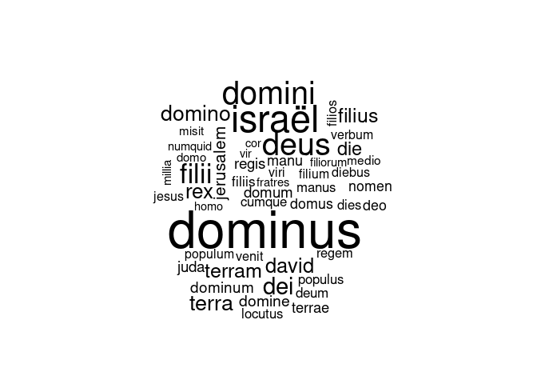
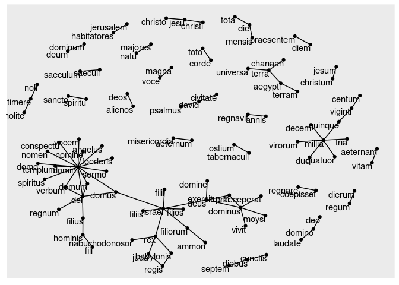

# Analyzing the Clementine Vulgate with R

I am a firm believer in the holiness and sacred nature of the Latin
language in our world and in the Church. Furthermore, I also believe in
the power of computation and consider myself a bit of a techno-optimist,
so I guess that it is natural that I wind up making a text analysis of
the Vulgate.

This analysis was made with a copy of the Vulgate(Clementine) that I
retrieved from [Luke Smith’s](https://github.com/lukesmithxyz) github. I
remember that it was actually kinda tough to work with some of the files
I was finding on the internet, but this one was super easy. For that,
thanks.

# Some notes on the Latin

If you do not know or have not studied Latin, one thing to note that is
crucial to this analysis is that various roles that a noun can play in a
sentence change its ending in Latin. I will refer to these throughout
the analyis as relevant. The cases are Nominative, subject or actor,
Accusative, direct object or acted upon, Genitive, belonging or
appertaining to something else, Dative, indirect object or indicating to
something, and the Ablative, meaning source of origin or the means by
which something is done.

# Most common words in the vulgate 

So for our first question, what are the most common words in the
Vulgate? For that, we can consult the graph above. Unsurprisingly, out
of the 12 most common words in the Vulgate, words that refer to
Adonai/Lord, Dominus, are the most common with the nominative form alone
showing up 3486 times and 6629 when including the ablative and the
genitive cases.

The direct word for God shows up in the second most common grouping when
accounting for different nominal forms at 3314 times. I think this is
relevant and interesting because it proves that the Bible is not a
document about us the readers, but about **God**. We must diminish so
that He may increase, and apparently this is nowhere more evident than
in His own Word.

Despite the fact that David, shows up among these most common words,
alongside filii and filius, the nominative and genitive for son, this
combination of frequent words may not necessarily that they immediately
apply to Jesus. This is what I initially thought, however, one of our
graphs and analyses further on, will contradict this. Nonetheless, it is
striking that David shows up more than, Moses, Abraham, Jacob, Isaac, or
even Jesus! Further analysis is necessary to confirm what I am about to
say, but I suspect that this may be due to the fact that Jewish names
are generally not declined for case in Latin. David being a Jewish name
and Jesus the Greco-Latinized form of Yeshua, may have a factor to play
in this, meaning that the count for Jesus is dispersed among the various
declensions of His name.

Before moving on, lets look at a Wordcloud of the most common terms.
Wordclouds are useful for visualizing the frequency of words in size
compared to others.

# What ideas are closest in the Vulgate?

In order to find out what ideas are closest in the vulgate, we will be
using a word map, where each point represents and is labeled by a word
and connected to the word it most frequently appears next to via a line.

The following graph will connect all of the bigrams that appear more
than 30 times in the Vulgate.

 

Once again, we can see that the most common nexus or webcenter of ideas in
the Vulgate is the Lord, with Domini occupying our densest cluster of
ideas.

Some other notable ideas present in the Vulgate we can see here are,
eternal mercy, misericordia aeternum, eternal life, vitam aeternam, do
not fear, noli/nolite timere, etc.

I find these results interesting because it can quantify the nature of
scripture in a way. In fact it confirms, the purpose of the text and the
benevolent nature that it extends.

# Sentiment Analysis

Finally, we come to the last part of our analysis, sentiment. Here we
will be using the NRC lexicon from Mohammad and Turney(2013) that
classifies each word with one of 8 emotions (anger, anticipation,
disgust, fear, joy, sadness, surprise, and trust) and two sentiments,
positive and negative.

Naturally we have run the whole Vulgate through the lexicon to find the
most common emotions and sentiments as can be seen below.

 

Once again, the graphs explain the message of Scripture. Positivity and Trust
abound within this book. Trust alone accounts for nearly double the
second most common emotion of fear while there are nearly ten thousand
more representations of positivity as opposed to negativity, indicating
that the Vulgate is 1.5X more positive in vocabulary and word usage than
negative.

Much more could be said about the sentiment and emotion of the book. So
I will be leaving you, the reader, with the counts of what words are
contributing the most to each emotion down below.

# Anger

# Surprise

# Anticipation

# Disgust

# Fear

# Sadness

# Surprise

# Trust

 

# Negative

# Positive

# Conclusion

Before formally concluding this post, I want to provide you with a tidy
version of the Latin NRC Lexicon. The one available on Muhammad and
Turner’s site is a bit too much for what I imagine most people will need
and so I have tidied it to be more like the one used in the tidytext
library’s get\_sentiment function. You can download this version
[here](https://github.com/Mexicajun1605/Sams_BlogDown/blob/main/content/posts/vulgate_files/latin_nrc_lex.csv)

While this was a fun project, I think that we can use computational
methods for analyzing scripture beyond just what is exploratory. And
even though that is exactly what this was, it shows just how true we are
to take Scripture and perceive it.

I hope that you got something out of this.

Pax domini tecum Gratias Deo,

## Bibliography

-   Silge, J., & Robinson, D. (2017). Text mining with R: A tidy
    approach. ” O’Reilly Media, Inc.”.
-   St. Jerome (384) Vulgate (translation of the Holy scripture into
    Latin)
-   Mohammad, S. M., & Turney, P. D. (2013). Nrc emotion lexicon.
    National Research Council, Canada, 2, 234.
